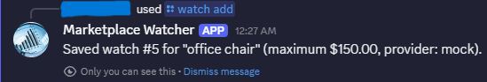
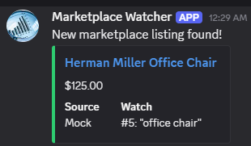
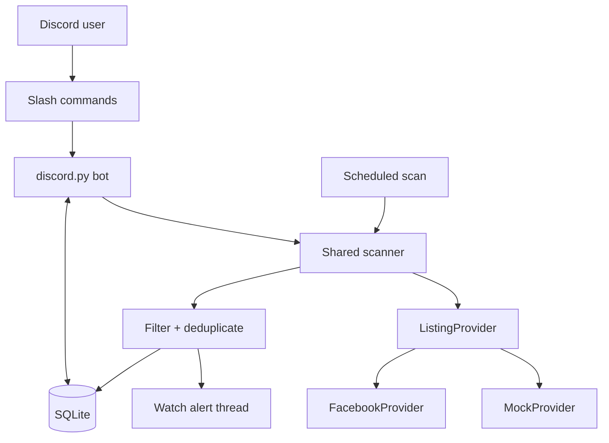

# Marketplace Discord Bot

[](https://github.com/soham01-eng/marketplace_discord_bot/actions/workflows/ci.yml)
[](https://www.python.org/)
[](LICENSE)

A completed, local-first Python MVP that turns Discord slash commands into
persistent marketplace watches. It scans on a configurable 15–45 minute
interval, filters and deduplicates normalized listings, and posts new matches
to one Discord thread per watch.

I built this project to solve a practical problem: useful Marketplace listings
can disappear before delayed platform notifications arrive. The result is a
$0 personal tool for up to two users and a portfolio project demonstrating
asynchronous workflows, SQLite persistence, browser automation, automated
testing, CI, and deliberate failure handling.

**[Read the design document](docs/DESIGN.md)** for the architecture, data model,
reliability rules, scope decisions, and tradeoffs behind the implementation.

## Project snapshot

| Area | Implemented result |
|---|---|
| User experience | Five Discord slash commands and one alert thread per watch |
| Persistence | SQLite watches, thread IDs, scan timestamps, and seen listing IDs |
| Scanning | Shared manual/scheduled scanner with a single-run async lock |
| Providers | Deterministic local `MockProvider` and experimental anonymous `FacebookProvider` |
| Reliability | Per-watch failure isolation, idempotent deduplication, and thread recreation |
| Validation | pytest, Ruff, dependency checks, and GitHub Actions on Python 3.11 and 3.14 |
| Runtime | Manual local launch or automatic Windows Task Scheduler startup |

## Demo

| Create a persistent watch | Receive a new-listing alert |
|:---:|:---:|
|  |  |

## Engineering highlights

- **Replaceable provider boundary:** marketplace-specific retrieval and parsing
  stay behind the asynchronous `ListingProvider.search(watch)` contract.
- **Deterministic demo path:** tracked mock data exercises the full Discord,
  filtering, persistence, deduplication, and notification workflow without a
  network dependency.
- **One scanner path:** `/scan` and the 30-minute scheduler call the same
  orchestration code, preventing business logic from drifting.
- **Durable deduplication:** a SQLite uniqueness constraint on watch, provider,
  and external listing ID prevents repeated alerts across scans and restarts.
- **Graceful degradation:** one provider or notification failure is recorded
  without stopping the remaining watches.
- **External-dependency isolation:** CI uses mock data and saved Facebook HTML,
  so tests validate this codebase rather than Facebook availability.

## Architecture



Every provider returns the same normalized model:

```python
Listing(
    external_id="mock-1003",
    title="Herman Miller Office Chair",
    price=125.0,
    url="https://example.com/listings/mock-1003",
    image_url=None,
    source="mock",
)
```

A scan loads enabled watches, selects each watch's provider, normalizes and
filters its results, atomically records unseen IDs, and posts new matches to the
watch's Discord thread. Manual and scheduled scans are serialized through one
asynchronous lock.

## Features

- Create, list, and remove user-owned watches through Discord.
- Persist watches, alert-thread IDs, and seen listings across bot restarts.
- Scan manually or automatically every 30 minutes by default.
- Apply case-insensitive, all-words title matching and an optional maximum price.
- Mention the watch owner in a public thread visible to the private server.
- Reuse archived threads, recreate missing threads, and archive threads when
  their watch is removed.
- Show scanner state, interval, Discord latency, and the last completed scan.
- Validate environment settings without exposing secret values.
- Start automatically at Windows sign-in with retry and single-instance rules.

## Discord commands

| Command | Options | Result |
|---|---|---|
| `/watch add` | `query`, optional `max_price`, optional `provider` | Saves a watch, defaults to Facebook, and creates its alert thread |
| `/watch list` | None | Lists the requesting user's watches and numeric IDs |
| `/watch remove` | `watch_id` | Removes only an owned watch and archives its thread |
| `/scan` | None | Runs all enabled watches immediately and reports totals |
| `/status` | None | Shows bot, database, scanner, interval, and last-scan status |

Command responses are ephemeral. Watch summaries and listing alerts are posted
in watch-specific public threads under the configured marketplace channel.

## Providers

| Provider | Purpose | Network | Reliability |
|---|---|---:|---|
| `mock` | Repeatable development, tests, and portfolio demos | No | Deterministic and supported |
| `facebook` | Anonymous Marketplace access experiment | Yes | Experimental; access and markup can change |

`FacebookProvider` opens one bounded, location-scoped search page in a temporary
headless Chromium session. It extracts stable `/marketplace/item/<id>` links
without relying on generated CSS class names and stores no Facebook credentials,
cookies, or persistent browser profile.

Login redirects, challenges, timeouts, or unrecognized markup produce clear
provider errors. The scanner continues with other watches and never silently
substitutes mock listings. The project does not attempt CAPTCHA solving, proxy
rotation, fingerprint spoofing, checkpoint circumvention, or other anti-bot
bypasses.

## Repeatable demo

Use the mock provider to demonstrate the complete workflow without depending on
Facebook:

1. Start the bot with `python main.py`.
2. Run `/watch add` with:
   - `query`: `office chair`
   - `max_price`: `150`
   - `provider`: `Mock (demo data)`
3. Run `/scan` and open the new watch thread.
4. Confirm the $125 Herman Miller Office Chair alert.
5. Run `/scan` again and confirm that no duplicate alert is sent.
6. Restart the bot and run `/watch list` to confirm persistence.

Test anonymous Facebook access independently from Discord with:

```bash
python -m scripts.check_facebook_access --query "office chair"
```

A successful run prints up to five normalized listings. A login redirect or
provider error is an expected experimental outcome and does not affect the mock
demo.

## Local setup

### Prerequisites

- Python 3.11 or newer
- Git
- A Discord account, application, and private test server
- Playwright Chromium only when using Facebook watches

### 1. Clone and install

Windows PowerShell:

```powershell
git clone https://github.com/soham01-eng/marketplace_discord_bot.git
cd marketplace_discord_bot
py -3 -m venv .venv
Set-ExecutionPolicy -Scope Process -ExecutionPolicy Bypass
.\.venv\Scripts\Activate.ps1
python -m pip install --upgrade pip
python -m pip install -e ".[dev]"
Copy-Item .env.example .env
```

macOS or Linux:

```bash
git clone https://github.com/soham01-eng/marketplace_discord_bot.git
cd marketplace_discord_bot
python3 -m venv .venv
source .venv/bin/activate
python -m pip install --upgrade pip
python -m pip install -e ".[dev]"
cp .env.example .env
```

Install Chromium only if you plan to use Facebook watches:

```bash
python -m playwright install chromium
```

### 2. Create and install the Discord bot

1. Create an application in the
   [Discord Developer Portal](https://discord.com/developers/applications).
2. Copy its bot token directly into your local `.env`.
3. Create a text channel such as `#marketplace` in the private server.
4. Enable Discord Developer Mode and copy the server and channel IDs.
5. Under the application's **Installation** settings, enable **Guild Install**.
6. Add the `applications.commands` and `bot` scopes.
7. Grant **View Channels**, **Send Messages**, **Embed Links**, **Create Public
   Threads**, **Send Messages in Threads**, and **Manage Threads**, then install
   the application.

No privileged Discord intents are required. Never paste the bot token into an
issue, screenshot, terminal transcript, or commit.

### 3. Configure `.env`

```dotenv
DISCORD_TOKEN=replace_with_your_bot_token
DISCORD_GUILD_ID=replace_with_your_test_server_id
DISCORD_MARKETPLACE_CHANNEL_ID=replace_with_your_marketplace_channel_id
SCAN_INTERVAL_MINUTES=30
DATABASE_PATH=data/marketplace.db
FACEBOOK_MARKETPLACE_LOCATION=detroit
```

| Variable | Required | Default | Description |
|---|---:|---|---|
| `DISCORD_TOKEN` | Yes | — | Secret bot token from the Developer Portal |
| `DISCORD_GUILD_ID` | Yes | — | Server where slash commands are synchronized |
| `DISCORD_MARKETPLACE_CHANNEL_ID` | Yes | — | Parent text channel for watch threads |
| `SCAN_INTERVAL_MINUTES` | No | `30` | Scheduled interval, validated from 15 to 45 minutes |
| `DATABASE_PATH` | No | `data/marketplace.db` | Local SQLite database path |
| `FACEBOOK_MARKETPLACE_LOCATION` | No | `detroit` | Marketplace location slug, such as `ann-arbor` |

`.env`, SQLite files, logs, browser data, and Playwright output are ignored by
Git.

## Run the bot

### Manual launch

From the repository root:

```powershell
Set-ExecutionPolicy -Scope Process -ExecutionPolicy Bypass
.\.venv\Scripts\Activate.ps1
python main.py
```

The bot synchronizes commands to the configured server, connects to Discord,
and starts the scheduled scanner. Keep the PowerShell window open and press
`Ctrl+C` to stop it.

### Automatic Windows startup

Register the bot with Windows Task Scheduler and start it immediately:

```powershell
powershell -ExecutionPolicy Bypass -File .\scripts\setup_windows_task.ps1 -StartNow
```

The task starts at user sign-in, waits for a network connection, retries a
failed process three times, prevents a second scheduled instance, and has no
execution time limit. The PC must remain powered on, online, and awake.

Inspect, start, or stop it with:

```powershell
Get-ScheduledTask -TaskName "Marketplace Discord Bot"
Start-ScheduledTask -TaskName "Marketplace Discord Bot"
Stop-ScheduledTask -TaskName "Marketplace Discord Bot"
```

Remove only the scheduled task with:

```powershell
powershell -ExecutionPolicy Bypass -File .\scripts\setup_windows_task.ps1 -Remove
```

Stop the scheduled task before launching `main.py` manually to avoid two bot
processes scanning the same local database.

## Quality checks

```bash
python -m pip check
python -m ruff check .
python -m ruff format --check .
python -m pytest
```

The deterministic test suite covers configuration validation, SQLite ownership
and migration, provider normalization, saved Facebook HTML parsing, filters,
deduplication, watch-thread lifecycle, notification embeds, shared scan entry
points, failure isolation, commands, and scheduling. GitHub Actions runs the
same quality gate on Python 3.11 and 3.14 without Discord secrets, Chromium, or
live Facebook access.

## Project structure

```text
marketplace_discord_bot/
├── data/                         # Tracked mock data; local database is ignored
├── docs/
│   ├── DESIGN.md                 # As-built architecture and decisions
│   └── screenshots/              # Sanitized Discord portfolio images
├── scripts/                      # Facebook check and Windows startup setup
├── src/
│   ├── providers/                # Provider contract, mock, and Facebook
│   ├── bot.py                    # Discord commands and scheduled entry point
│   ├── config.py                 # Validated environment configuration
│   ├── database.py               # SQLite watches and seen listings
│   ├── filters.py                # Provider-independent matching rules
│   ├── models.py                 # Normalized Watch and Listing models
│   ├── notifier.py               # Watch threads and listing embeds
│   └── scanner.py                # Shared orchestration and failure isolation
├── tests/                        # Deterministic unit and integration tests
├── .github/workflows/ci.yml      # Python 3.11 and 3.14 quality gate
├── main.py                       # Application entry point
└── pyproject.toml                # Package, dependencies, pytest, and Ruff
```

## Key tradeoffs

| Decision | Benefit | Cost |
|---|---|---|
| Discord as the complete UI | Commands and notifications without a separate frontend or hosting bill | Requires a Discord server |
| SQLite persistence | Zero-cost durability for one or two local users | Not suitable for distributed instances |
| Save before notifying | Prevents duplicate alerts across scans and restarts | Failed notifications are not retried |
| Saved HTML in CI | Stable parser tests without live Facebook access | Cannot prove current anonymous availability |
| Local-first runtime | Meets the $0 constraint and keeps secrets on the owner's PC | Scanning stops while the PC is offline or asleep |

See [docs/DESIGN.md](docs/DESIGN.md) for the full reasoning and implementation
details.

## Known limitations

- Facebook access is anonymous and experimental; availability can change by
  location, network, or Marketplace markup.
- Polling is interval-based rather than real time.
- The MVP synchronizes slash commands to one configured Discord server.
- Watches cannot yet be edited, paused, or re-enabled through Discord.
- Query matching is intentionally simple: every whitespace-separated word must
  appear in the listing title.
- Failed notifications are isolated but are not retried because listings are
  persisted before notification.
- The scanner targets a small personal workload, not large-scale crawling or
  multi-instance deployment.

## Future improvements

- Add edit, enable, and disable commands for existing watches.
- Expose minimum price, include/exclude words, radius, location, and price-drop
  controls.
- Add notification retry state without reintroducing duplicate alerts.
- Add provider health and recent failure summaries to `/status`.
- Support another documented provider through the existing interface.
- Package an optional always-on deployment path while preserving local use.

## License

Licensed under the [Apache License 2.0](LICENSE).
