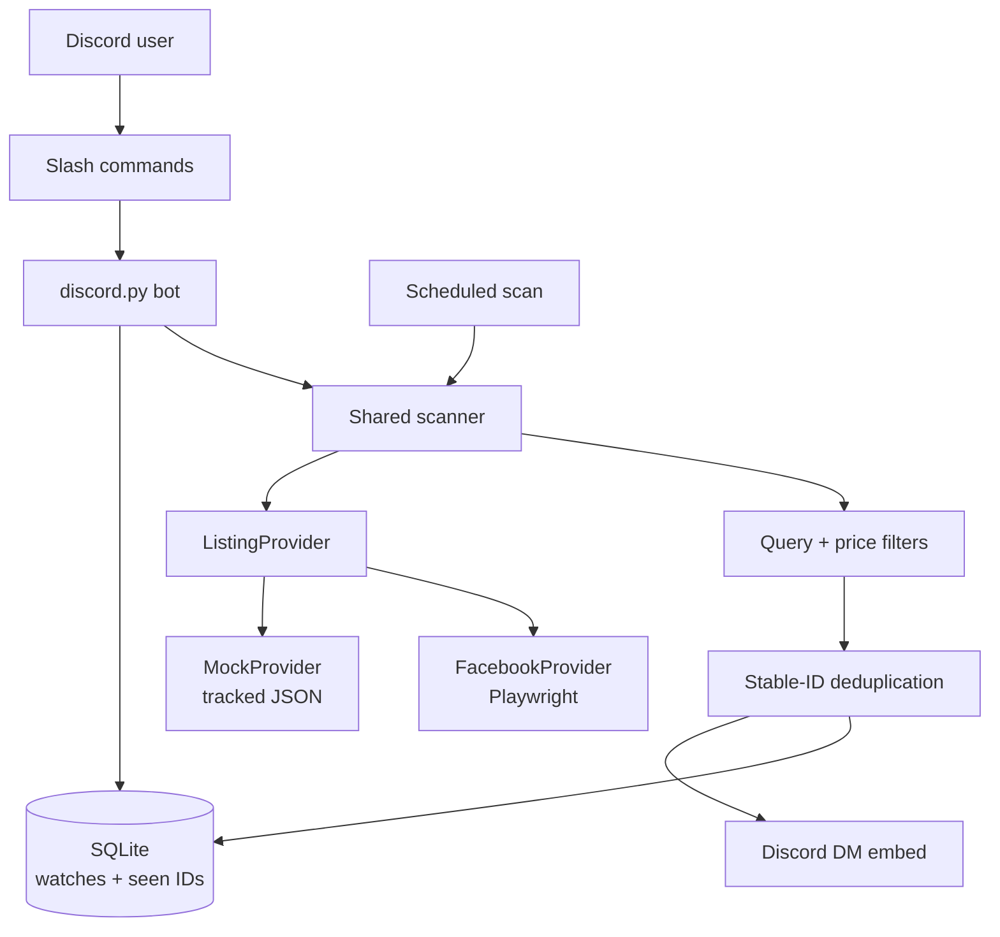

# Marketplace Discord Bot

[](https://github.com/soham01-eng/marketplace_discord_bot/actions/workflows/ci.yml)
[](https://www.python.org/)
[](LICENSE)

A local-first Python bot that turns Discord slash commands into persistent
marketplace watches and sends direct-message alerts for newly discovered
listings.

The project is a completed, resume-focused MVP built to demonstrate Discord
bot development, asynchronous workflows, SQLite persistence, browser
automation, data normalization, automated testing, and CI. It remains fully
demonstrable through deterministic mock data even when an external marketplace
is unavailable.

## Features

- Manage personal watches through `/watch add`, `/watch list`, and
  `/watch remove`.
- Persist watches and seen listing IDs in SQLite across bot restarts.
- Run scans manually with `/scan` or automatically every 30 minutes by
  default.
- Apply case-insensitive, all-words query matching and an optional maximum
  price.
- Prevent duplicate alerts using stable, provider-specific listing IDs.
- Send new matches as Discord direct-message embeds with title, price, source,
  link, and an optional image.
- Isolate failures so one unavailable provider or failed notification does not
  stop the remaining watches.
- Switch between a reliable `MockProvider` and an experimental anonymous-first
  `FacebookProvider` through one provider interface.
- Validate the project with pytest, Ruff, and GitHub Actions on Python 3.11 and
  3.14.

## Architecture



Manual and scheduled scans call the same scanner, so filtering,
deduplication, notifications, and failure handling cannot drift between two
implementations. Marketplace-specific code stays behind the asynchronous
`ListingProvider.search(watch)` contract and returns one normalized model:

```python
Listing(
    external_id="mock-1003",
    title="Herman Miller Office Chair",
    price=125.0,
    url="https://example.com/listings/mock-1003",
    image_url=None,
    source="mock",
)
```

The scanner therefore does not need to know whether a listing came from a
local JSON fixture, Facebook Marketplace, or a future provider.

### Scan lifecycle

1. Load every enabled watch from SQLite.
2. Select the provider recorded on that watch.
3. Request normalized listings from the provider.
4. Apply query and maximum-price filters.
5. Save each new stable listing ID before notifying the owner.
6. Send a Discord DM for each newly saved match.
7. Record the scan result and continue past isolated failures.

## Providers

| Provider | Purpose | Network | Reliability |
|---|---|---:|---|
| `mock` | Repeatable development, tests, and portfolio demos | No | Deterministic and supported |
| `facebook` | Anonymous Marketplace access experiment | Yes | Experimental; access and markup can change |

`MockProvider` reads tracked records from `data/sample_listings.json`. It is the
default for new watches and keeps the complete bot workflow useful without an
external dependency.

`FacebookProvider` opens one bounded, location-scoped search page in a
temporary headless Chromium session. It identifies stable
`/marketplace/item/<id>` links and normalizes their title, price, canonical URL,
and optional image without depending on generated CSS class names. It stores no
Facebook credentials, cookies, or persistent browser profile.

Facebook may redirect anonymous browsers to login, present a challenge, time
out, or change its markup. These states produce clear provider errors; the
scanner records a failure for that watch and continues. The implementation does
not attempt CAPTCHA solving, proxy rotation, fingerprint spoofing, checkpoint
circumvention, or other anti-bot bypasses.

## Discord commands

| Command | Options | Result |
|---|---|---|
| `/watch add` | `query`, optional `max_price`, optional `provider` | Saves a user-owned watch; `mock` is the default provider |
| `/watch list` | None | Lists the requesting user's watches and numeric IDs |
| `/watch remove` | `watch_id` | Removes only a watch owned by the requesting user |
| `/scan` | None | Runs all enabled watches immediately and reports totals |
| `/status` | None | Shows bot, database, scanner, interval, and last-scan status |

Command responses are ephemeral. Matching-listing notifications are sent as
direct messages.

## Local setup

### Prerequisites

- Python 3.11 or newer
- Git
- A Discord account and private test server
- A Discord application installed in that server
- Chromium through Playwright only if using the experimental Facebook provider

### 1. Clone the project

```bash
git clone https://github.com/soham01-eng/marketplace_discord_bot.git
cd marketplace_discord_bot
```

### 2. Create the environment

Windows PowerShell:

```powershell
py -3 -m venv .venv
Set-ExecutionPolicy -Scope Process -ExecutionPolicy Bypass
.\.venv\Scripts\Activate.ps1
python -m pip install --upgrade pip
python -m pip install -e ".[dev]"
Copy-Item .env.example .env
```

The execution-policy change applies only to the current PowerShell window.

macOS or Linux:

```bash
python3 -m venv .venv
source .venv/bin/activate
python -m pip install --upgrade pip
python -m pip install -e ".[dev]"
cp .env.example .env
```

Install Chromium if you plan to use `facebook` watches:

```bash
python -m playwright install chromium
```

The reliable mock demo does not make network requests or require a browser.

### 3. Create and install the Discord bot

1. Create an application in the
   [Discord Developer Portal](https://discord.com/developers/applications).
2. Open **Bot**, reset the token, and copy it directly into your local `.env`.
3. Enable Developer Mode in Discord and copy your private test server's ID.
4. Under the application's **Installation** settings, enable **Guild Install**.
5. Add the `applications.commands` and `bot` scopes.
6. Grant **View Channels**, **Send Messages**, and **Embed Links**, then install
   the application in the test server.

No privileged Discord intents are required. Never paste the bot token into an
issue, screenshot, terminal transcript, or commit.

### 4. Configure `.env`

```dotenv
DISCORD_TOKEN=replace_with_your_bot_token
DISCORD_GUILD_ID=replace_with_your_test_server_id
SCAN_INTERVAL_MINUTES=30
DATABASE_PATH=data/marketplace.db
FACEBOOK_MARKETPLACE_LOCATION=detroit
```

| Variable | Required | Default | Description |
|---|---:|---|---|
| `DISCORD_TOKEN` | Yes | — | Secret bot token from the Developer Portal |
| `DISCORD_GUILD_ID` | Yes | — | Server where development slash commands are synchronized |
| `SCAN_INTERVAL_MINUTES` | No | `30` | Scheduled interval; validated between 15 and 45 minutes |
| `DATABASE_PATH` | No | `data/marketplace.db` | Local SQLite database path |
| `FACEBOOK_MARKETPLACE_LOCATION` | No | `detroit` | Marketplace URL location slug, such as `ann-arbor` |

`.env`, SQLite files, logs, browser data, and Playwright output are ignored by
Git.

### 5. Run the bot

```bash
python main.py
```

The bot synchronizes commands to the configured test server, connects to
Discord, and starts the scheduled scanner. Stop it with `Ctrl+C`.

## Reliable demo walkthrough

Use the mock provider for a repeatable end-to-end demonstration:

1. Start the bot with `python main.py`.
2. Run `/watch add` and enter separate command fields:
   - `query`: `office chair`
   - `max_price`: `150`
   - `provider`: `Mock (demo data)`
3. Run `/scan`.
4. Confirm the DM for the $125 Herman Miller Office Chair.
5. Run `/scan` again and confirm it sends no duplicate notification.
6. Restart the bot and use `/watch list` to confirm SQLite persistence.

To test anonymous Facebook access independently from Discord:

```bash
python -m scripts.check_facebook_access --query "office chair"
```

A successful result prints up to five normalized listings. Login redirection
or another clear provider error is also a valid experimental outcome and does
not affect the mock workflow.

## Quality checks

```bash
python -m pip check
python -m ruff check .
python -m ruff format --check .
python -m pytest
```

The test suite covers configuration validation, database ownership and
persistence, provider normalization, saved Facebook HTML parsing, filters,
deduplication, notification embeds, shared scan entry points, failure
isolation, command behavior, and scheduling. CI runs the dependency, lint,
format, and pytest checks on Python 3.11 and 3.14 without Discord secrets,
Chromium, or live Facebook access.

## Project structure

```text
marketplace_discord_bot/
├── data/                         # Tracked mock data; local database is ignored
├── scripts/                      # Standalone Facebook access experiment
├── src/
│   ├── providers/                # Provider contract, mock, and Facebook
│   ├── bot.py                    # Discord commands and scheduled entry point
│   ├── config.py                 # Validated environment configuration
│   ├── database.py               # SQLite watches and seen listings
│   ├── filters.py                # Provider-independent matching rules
│   ├── models.py                 # Normalized Watch and Listing models
│   ├── notifier.py               # Discord DM embeds
│   └── scanner.py                # Shared orchestration and failure isolation
├── tests/                        # Deterministic unit and integration tests
├── .github/workflows/ci.yml      # Python 3.11 and 3.14 quality gate
├── main.py                       # Application entry point
└── pyproject.toml                # Package, dependencies, pytest, and Ruff
```

## Engineering decisions

| Decision | Reason | Tradeoff |
|---|---|---|
| Discord as the complete UI | Delivers commands and notifications without a separate frontend or hosting bill | Requires a Discord account and server |
| SQLite for persistence | Zero-cost, durable, and appropriate for one or two local users | Not intended for distributed bot instances |
| Shared scanner for manual and scheduled runs | Keeps matching, deduplication, and errors consistent | Scans are serialized through one asynchronous lock |
| Provider normalization boundary | Keeps marketplace markup out of bot, storage, and notification code | Each new provider needs an adapter and parser tests |
| Save before notifying | Prevents duplicate alerts across restarts and repeated scans | A failed DM is recorded as seen and is not retried |
| Saved HTML fixture in CI | Tests Facebook parsing without unstable live access | The fixture cannot guarantee current anonymous access |
| Local-first deployment | Meets the $0 MVP constraint and keeps secrets on the owner's PC | Scanning stops when the computer or process is offline |

## Known limitations

- Facebook access is anonymous and experimental; availability varies by
  location, network, and future Marketplace changes.
- Polling is not real time. Results arrive on the configured interval or after
  a manual `/scan`.
- The MVP synchronizes slash commands to one configured development server.
- A user must allow direct messages from the server to receive listing alerts.
- Query matching requires every whitespace-separated query word to appear in
  the listing title; advanced include/exclude filters are not exposed yet.
- Watches can be created, listed, and removed, but not edited, paused, or
  re-enabled through Discord.
- The scanner is designed for a small personal workload, not large-scale
  marketplace crawling or multi-instance deployment.
- Failed notifications are counted and isolated but are not retried.

## Future improvements

- Add edit, enable, and disable commands for existing watches.
- Expose minimum price, required-word, excluded-word, radius, and per-watch
  location controls.
- Add notification retry state without reintroducing duplicate alerts.
- Add provider health details and recent failure summaries to `/status`.
- Support another documented provider through the same interface.
- Package an optional always-on deployment path while preserving local use.

## Lessons demonstrated

- Normalize unreliable external data at the boundary instead of leaking
  marketplace-specific structures through the application.
- Keep a deterministic provider and saved fixtures so CI and demos do not
  depend on a live third-party website.
- Persist deduplication state before sending alerts to make repeated and
  scheduled scans idempotent.
- Reuse one orchestration path for commands and background jobs.
- Treat configuration as validated input and keep secrets and generated data
  outside version control.
- Design external integrations to fail visibly and safely without expanding
  into anti-bot bypass techniques.

## License

Licensed under the [Apache License 2.0](LICENSE).
