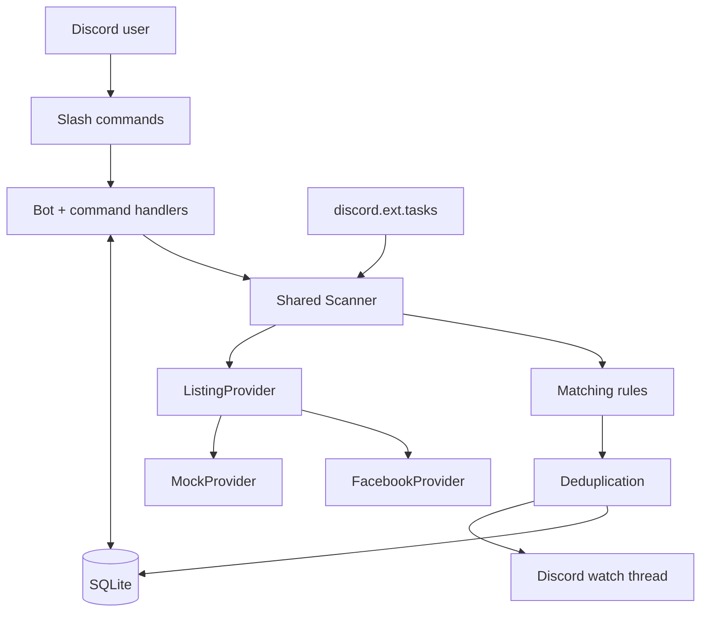
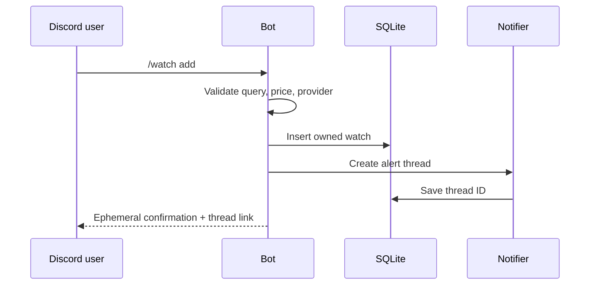
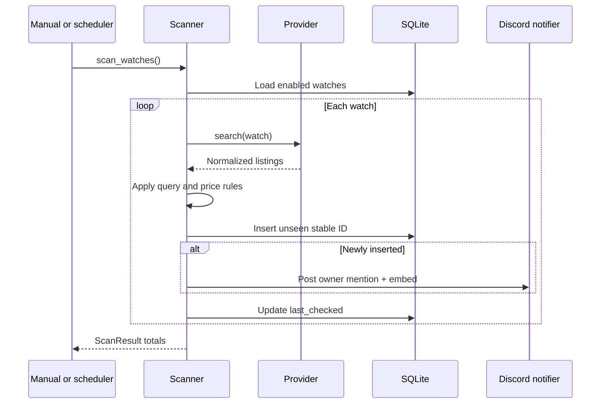

# Marketplace Discord Bot — Design Document

**Status:** Implemented MVP  
**Intended scale:** One private Discord server, up to two users  
**Runtime:** Local computer, with optional Windows automatic startup  
**Cost target:** $0

## 1. Executive summary

Marketplace listings can sell before delayed platform notifications reach an
interested buyer. This project provides a small local service that accepts
searches through Discord, polls listing providers every 15–45 minutes, and
posts newly discovered matches to watch-specific Discord threads.

The central design decision is to treat every marketplace as an unreliable,
replaceable dependency. Provider adapters return one normalized `Listing`
model; the core scanner owns matching, persistence, deduplication, and
notifications. A deterministic `MockProvider` keeps the complete workflow
testable and demonstrable when Facebook is unavailable.

The implemented MVP uses Python, discord.py, SQLite, Playwright, pytest, Ruff,
and GitHub Actions. It runs locally to keep infrastructure cost at zero and can
start automatically at Windows sign-in.

## 2. Goals and constraints

### Functional goals

- Create, list, and remove user-owned watches through Discord slash commands.
- Persist watches and deduplication state across process restarts.
- Poll enabled watches every 15–45 minutes, with a 30-minute default.
- Normalize listings before applying provider-independent matching rules.
- Notify the watch owner only when a stable listing ID has not been seen for
  that watch.
- Keep manual and scheduled scanning behavior identical.
- Optionally restrict Facebook alerts to a configured center and radius.
- Remain useful for demos and tests without a live marketplace.
- Fail clearly and continue scanning when an external provider is unavailable.

### Portfolio goals

- Demonstrate asynchronous Python and event-driven integration work.
- Show separation between UI, orchestration, persistence, providers, matching,
  and notification delivery.
- Include deterministic automated tests, linting, CI, screenshots, and clear
  technical documentation.
- Make important tradeoffs easy to discuss in an interview.

### Non-goals

The MVP intentionally excludes a web dashboard, React, standalone user
accounts, OAuth, cloud infrastructure, PostgreSQL, Redis, message queues,
microservices, large-scale crawling, CAPTCHA solving, proxy rotation,
fingerprint spoofing, and anti-bot circumvention.

Discord is the frontend, SQLite is the database, and one local process is the
deployment model.

## 3. System architecture



### Component responsibilities

| Component | Responsibility |
|---|---|
| `main.py` | Load `.env`, configure logging, validate settings, and start the bot |
| `src/bot.py` | Register slash commands, synchronize them to one guild, and start scheduled scans |
| `src/database.py` | Own the SQLite connection, schema, additive migration, watch CRUD, and seen-listing writes |
| `src/scanner.py` | Serialize scans, select providers, apply filters, persist new IDs, notify, and isolate failures |
| `src/providers/` | Retrieve marketplace-specific data and return normalized `Listing` objects |
| `src/filters.py` | Apply case-insensitive all-words title matching and price bounds |
| `src/notifier.py` | Create, reuse, recreate, and archive watch threads; format listing embeds |
| `src/config.py` | Validate required IDs, token presence, polling range, paths, Facebook location slug, and optional radius settings |
| `src/geo.py` | Validate a search area and calculate straight-line distances without network calls |

The dependency direction is intentional: providers know how to translate
external data into application models, while the scanner does not know how any
marketplace page is structured.

## 4. Core runtime flows

### Create a watch



If thread creation fails, the command deletes the newly inserted watch so the
database cannot retain an unusable watch without an alert destination.

### Scan enabled watches



Both `/scan` and `discord.ext.tasks` call `MarketplaceBot.run_scan()`, which
delegates to the same `Scanner.scan_watches()` method. An `asyncio.Lock`
prevents overlapping manual and scheduled runs.

## 5. Provider boundary and normalization

All providers implement one asynchronous contract:

```python
class ListingProvider(ABC):
    @abstractmethod
    async def search(self, watch: Watch) -> list[Listing]: ...
```

They return the same immutable data model:

```python
Listing(
    external_id="123456789",
    title="ASUS RTX 4070",
    price=400.0,
    url="https://...",
    image_url="https://...",
    source="facebook",
)
```

This boundary keeps external page formats out of database, filtering,
notification, and command code. Adding a provider requires an adapter that
produces normalized listings plus provider-focused tests; the scanner and
Discord workflow should not change.

### MockProvider

`MockProvider` reads tracked JSON from `data/sample_listings.json`. It provides:

- predictable portfolio demonstrations;
- network-free development;
- normalized model coverage;
- a complete end-to-end path when Facebook access changes.

Mock mode is a supported runtime option, not a fallback secretly used after a
Facebook failure.

### FacebookProvider

`FacebookProvider` uses a temporary, anonymous, headless Chromium session to
open one bounded, location-scoped Marketplace search page. It:

- URL-encodes the watch query;
- waits for stable `/marketplace/item/<id>` links;
- parses standard HTML without generated CSS class names;
- extracts the stable listing ID, title, optional price and image, and a
  canonical item URL;
- deduplicates repeated cards within the page;
- limits each search to at most 20 normalized results by default;
- closes the browser after each search.

The provider distinguishes a known empty result from login redirects,
checkpoints, access challenges, timeouts, and unrecognized markup. Expected
access failures use explicit provider error types so the scanner can log the
failure and continue.

No Facebook credentials, cookies, or persistent browser profile are stored.

### Optional search radius

The September 2026 radius addition keeps geographic filtering inside the
Facebook adapter. Three optional `.env` settings specify latitude, longitude,
and radius in miles. They must be provided together; absent/blank settings
preserve city-only searches. The example uses 42.377, -83.0796, the approximate
center of ZIP 48202 from [Zippopotam.us](https://api.zippopotam.us/us/48202), and
20 miles. There is no runtime geocoding dependency or database migration.

The search URL includes best-effort coordinate and kilometer-radius hints, but
correctness does not depend on Facebook honoring them. After normalizing up to
50 visible cards from the same bounded page, the adapter joins card IDs to JSON
objects with a matching `id` and direct `location.latitude` / `location.longitude`.
It reads only inert `application/json` scripts and never executes their contents.
Unrelated/seller coordinates, invalid values, and conflicting locations are not
used. Haversine distance decides whether each verified card lies within the
inclusive radius. Only then is the normal result limit applied.

Unknown and out-of-range cards never reach the scanner's persistence or alert
path. If every visible card lacks verifiable coordinates, the provider raises
an explicit error; verified but entirely distant results legitimately return
an empty list. Partial unknowns are skipped with a warning. This favors avoiding
distant alerts at the cost of potentially missing nearby listings. Coordinates
are approximate, and the radius measures straight-line rather than driving
distance. This filters retrieved candidates; it cannot guarantee exhaustive
coverage of every nearby listing.

The settings apply to existing and future Facebook watches after a restart.
`/status` displays the active area. The standalone check loads the same area
settings without Discord secrets and accepts latitude/longitude/radius flags.
Mock listings, the shared `Listing` model, and SQLite schema are unchanged.
Synthetic fixtures cover the supported metadata shape; live anonymous coordinate
availability requires a separate local check.


## 6. Matching and deduplication

The provider performs retrieval; Python owns the final watch rules.

Current matching behavior:

1. Case-fold the listing title and watch query.
2. Require every whitespace-separated query word to appear in the title.
3. Apply inclusive minimum and maximum price bounds when present.
4. Treat an unknown listing price as a match only when the watch has no price
   bounds.

The Discord command currently exposes `max_price`; `min_price` is supported by
the model, database, and filter but is not exposed in `/watch add`.

Deduplication is enforced in SQLite with:

```text
UNIQUE (watch_id, provider, external_id)
```

`INSERT ... ON CONFLICT DO NOTHING` makes saving an already seen listing a
normal no-op. The scanner persists a listing before notifying, which guarantees
that repeated scans and process restarts do not duplicate alerts. The accepted
tradeoff is that a Discord delivery failure is not retried in the current MVP.

## 7. Persistence model

### `watches`

| Field | Purpose |
|---|---|
| `id` | Local numeric watch identifier |
| `discord_user_id` | Owner used for authorization and mentions |
| `discord_thread_id` | Alert destination; nullable until a thread is created |
| `query` | Search text |
| `min_price`, `max_price` | Optional inclusive bounds |
| `provider` | Provider lookup key |
| `enabled` | Scanner inclusion flag |
| `created_at`, `last_checked` | Timezone-aware UTC state |

### `seen_listings`

| Field | Purpose |
|---|---|
| `watch_id` | Parent watch with cascade deletion |
| `provider`, `external_id` | Stable deduplication identity |
| `title`, `price`, `url`, `image_url` | Listing snapshot at discovery time |
| `first_seen` | Timezone-aware UTC discovery time |

Foreign keys are enabled on connection. Deleting a watch cascades to its seen
listings. Startup creates missing tables and applies an additive migration for
the thread ID column so existing local watches are preserved.

## 8. Discord interaction design

| Command | Authorization and behavior |
|---|---|
| `/watch add` | Validates input, creates an owned watch and public alert thread, and rolls back on thread failure |
| `/watch list` | Returns only the requesting user's watches |
| `/watch remove` | Deletes only a watch owned by the requester and archives its thread |
| `/scan` | Runs all enabled watches and returns aggregate counts |
| `/status` | Reports online state, latency, database connection, scanner state, interval, and last completion |

Command responses are ephemeral. Each persistent watch receives one public
thread under the configured private-server text channel. The notifier posts a
watch summary as the thread's first message, mentions the owner on new matches,
and includes listing title, price, provider, triggering watch, link, and an
optional image.

If a stored thread was deleted, it is recreated and its new ID is persisted.
Removing a watch posts a final message and archives its thread. This structure
keeps alerts and any follow-up discussion grouped by search.

## 9. Reliability and failure behavior

| Situation | Implemented behavior |
|---|---|
| Manual scan overlaps scheduled scan | Async lock serializes the runs |
| One provider fails | Count and log the failure; continue with other watches |
| One notification fails | Count and log the failure; continue with remaining listings |
| Watch thread was deleted | Recreate it and persist the replacement ID |
| Thread creation fails during `/watch add` | Delete the just-created watch and return an actionable response |
| Existing listing appears again | SQLite conflict becomes a no-op; do not notify |
| Facebook login/challenge appears | Raise a clear provider access error; do not bypass it |
| Facebook markup is unrecognized | Raise a markup error instead of returning fabricated or mock data |
| Configuration is missing or invalid | Exit at startup with a safe message that does not expose secrets |

The scanner records `last_started_at`, `last_finished_at`, the latest
`ScanResult`, and each watch's `last_checked` time. Logging covers startup,
per-watch result counts, failures, and scan completion.

## 10. Configuration and deployment

Runtime configuration is loaded from `.env`:

| Setting | Rule |
|---|---|
| `DISCORD_TOKEN` | Required, non-empty secret |
| `DISCORD_GUILD_ID` | Required positive integer |
| `DISCORD_MARKETPLACE_CHANNEL_ID` | Required positive integer |
| `SCAN_INTERVAL_MINUTES` | Integer from 15 through 45; default 30 |
| `DATABASE_PATH` | Non-empty local path; default `data/marketplace.db` |
| `FACEBOOK_MARKETPLACE_LOCATION` | Lowercase letters, numbers, and hyphens; default `detroit` |
| `FACEBOOK_SEARCH_LATITUDE`, `FACEBOOK_SEARCH_LONGITUDE` | Optional valid coordinates, required together with radius |
| `FACEBOOK_SEARCH_RADIUS_MILES` | Optional finite positive distance; absent triplet means no distance limit |

The repository excludes `.env`, SQLite files, browser state, logs, and other
generated output. The bot requires no privileged Discord intents.

The local runtime has two supported launch paths:

- **Manual:** activate the virtual environment and run `python main.py`.
- **Automatic on Windows:** the provided PowerShell script registers a Task
  Scheduler entry at user sign-in. It uses the virtual environment's Python,
  sets the repository as the working directory, requires a network connection,
  retries failures three times at one-minute intervals, prevents duplicate
  scheduled instances, and has no execution time limit.

Automatic startup improves convenience but is not independent hosting; scans
stop while the computer is shut down or asleep.

## 11. Verification strategy

The test suite is intentionally independent of Discord credentials, Chromium,
and live Facebook access.

| Test layer | Coverage |
|---|---|
| Configuration | Required values, defaults, polling bounds, paths, and location validation |
| Database | CRUD, ownership, persistence, migration, cascade deletion, timestamps, and deduplication |
| Providers | Mock normalization and errors; Facebook URL building, saved-HTML parsing, limits, access states, radius boundaries, and unverified-coordinate handling |
| Filtering | Case-insensitive query words, inclusive prices, and unknown prices |
| Scanner | One-time notification, last-checked state, save-before-notify, and failure isolation |
| Discord integration | Command behavior, ownership, thread lifecycle, embeds, rollback, and timestamp formatting |
| Entry points | Manual and scheduled scans use the same scanner |

The quality gate is:

```bash
python -m pip check
python -m ruff check .
python -m ruff format --check .
python -m pytest
```

GitHub Actions executes the same gate on Python 3.11 and 3.14 for pushes and
pull requests to `main`. Facebook parser tests use a saved HTML fixture; live
anonymous access remains a separate manual check.

## 12. Key decisions and tradeoffs

| Decision | Rationale | Tradeoff |
|---|---|---|
| Discord as the complete UI | Commands, identity, and notifications without building or hosting a frontend | Requires Discord and a configured server |
| One public thread per watch | Keeps alerts and discussion grouped while preserving a readable parent channel | Requires thread permissions and stored thread state |
| SQLite | Durable, simple, zero-cost storage suited to one local process | Not intended for horizontal scaling |
| Provider normalization | Shields core logic from marketplace-specific data and markup | Every new source needs an adapter and focused tests |
| Mock provider as a first-class path | Makes demos and CI repeatable without external availability | Mock data cannot prove a live source currently works |
| Shared scanner | Prevents manual and scheduled behavior from diverging | Concurrent scan requests wait for one lock |
| Save before notify | Strong idempotency across repeated scans and restarts | Failed delivery is not retried in the MVP |
| Saved Facebook HTML in tests | Fast, stable parser validation | Does not detect live markup changes by itself |
| Anonymous, bounded Facebook access | Avoids storing credentials and limits retrieval scope | Access can fail or change without notice |
| Local-first deployment | Meets the $0 goal and keeps secrets local | Availability depends on the owner's PC |

## 13. Security and responsible-use boundaries

- Secrets live only in the ignored local `.env` file.
- Configuration errors never include the Discord token value.
- Discord commands enforce watch ownership for listing and deletion.
- Facebook access is anonymous and uses a temporary browser context.
- The provider visits one bounded search page and does not crawl seller
  profiles or infinite result pages.
- The project does not solve CAPTCHAs, rotate proxies, spoof browser
  fingerprints, persist authenticated sessions, or circumvent checkpoints.

## 14. Known limitations

- Facebook Marketplace access and markup are outside the project's control.
- Radius mode skips unverified locations and fails clearly when no card location
  can be verified; synthetic fixtures do not prove live metadata availability.
- Polling is interval-based rather than real time.
- The bot targets one configured Discord development server.
- Watch threads are visible to members who can access the parent channel.
- `/watch add` exposes query and optional maximum price, but not every field
  already represented in the model.
- Watches cannot be edited, paused, or re-enabled from Discord.
- Unknown-price listings are rejected when any price bound is present.
- Notification failures are not retried after save-before-notify deduplication.
- SQLite and the scanner are designed for a small, single-process workload.

## 15. Future evolution

The existing boundaries support incremental improvements without changing the
MVP's core architecture:

1. Add edit, enable, and disable commands.
2. Expose minimum price, include/exclude words, per-watch radius/location, and
   price-drop options through Discord.
3. Add notification delivery state and bounded retries.
4. Surface recent provider failures and health details through `/status`.
5. Implement another documented provider behind `ListingProvider`.
6. Offer an optional always-on runtime while preserving local operation.

Larger infrastructure such as PostgreSQL, queues, a web UI, or distributed
workers is intentionally deferred until user scale or reliability requirements
justify the added complexity.

## 16. MVP acceptance status

The implemented project satisfies the original MVP definition of done:

- Discord bot starts and synchronizes slash commands.
- Watches can be created, listed, and removed with ownership checks.
- Watches and seen listing IDs persist in SQLite.
- Mock and experimental Facebook providers share one contract.
- Manual and scheduled scans share one scanner.
- Matching, deduplication, notifications, status, and failure isolation work.
- Watch threads are created, reused, recreated, and archived through their
  lifecycle.
- Deterministic tests, Ruff checks, and multi-version CI pass.
- The repository includes screenshots, setup documentation, architecture,
  limitations, and a repeatable demo path.

The external marketplace remains replaceable. The core application—commands,
orchestration, persistence, matching, deduplication, scheduling, and
notifications—is the portfolio project.
